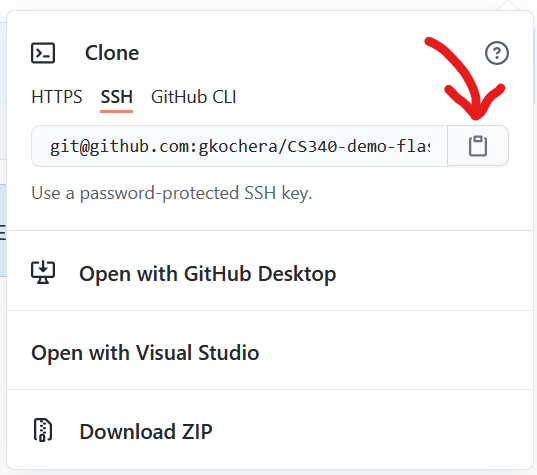
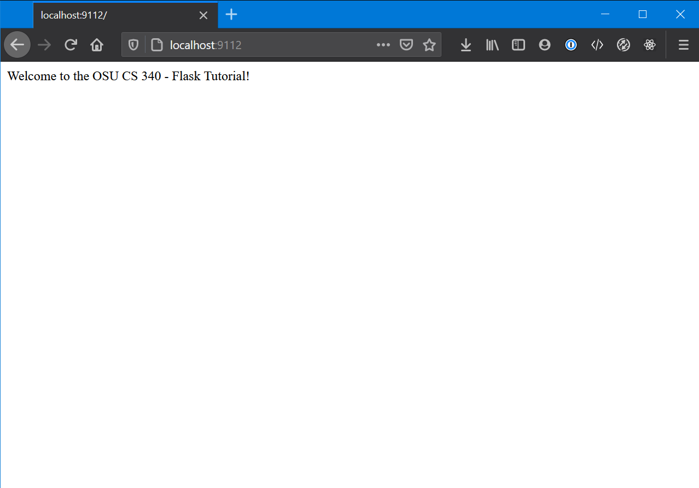
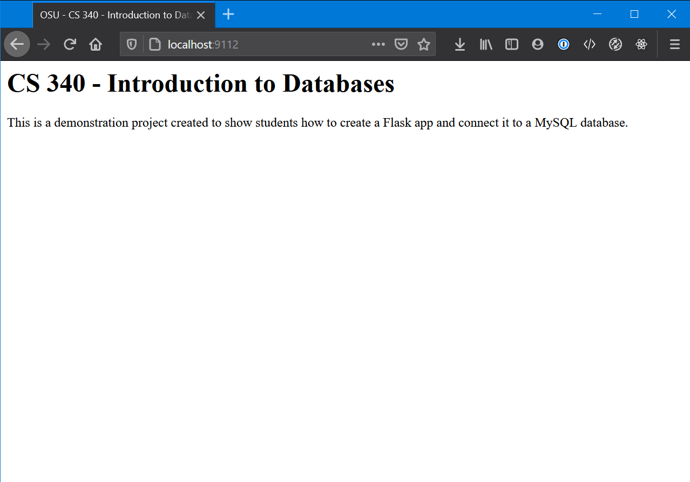
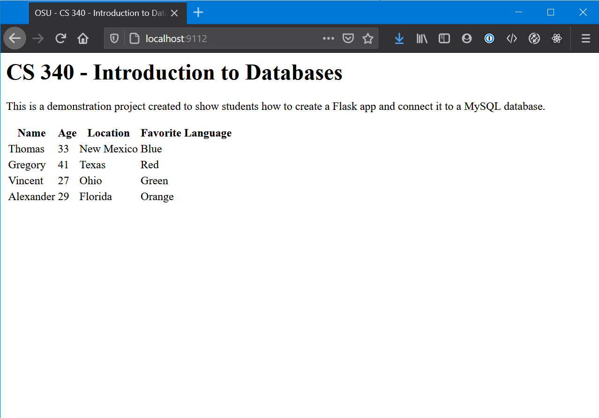

# Overview

## Table of Contents

- [Step 1 - Get the Tools Downloaded You Will Need](#Step-1)
- [Step 2 - Preparation](#Step-2)
- [Step 3 - Building app.py and our Template](#Step-3)
- [Step 4 - Connecting your Database](#Step-4)
# Setup

Preparation is key with any project, especially a portfolio project. You want to show prospective employers that you can not only be productive but also work efficiently. Preparation will also make your project flow smoothly as well as let you pinpoint the area where bugs are occuring with ease. Read on, and we will go throug a step-by-step guide on getting setup to run your first Flask project.

#Step-1
## Step 1 - Get The Tools Downloaded You Will Need

You are going to need a few things get going here.

### Text Editior

Text Editors are like clothes. Everyone has their preferences. I prefer VS Code so this guide will be built using that editor. You can use what you please. Atom, Sublime, Notepad, Vim, eMacs or even Notepad are completely acceptable. We just need to be able to edit our code.

### Database Engine

**MySQL** is the database we will be using in this class. MariaDB and PostgresSQL are other flavors of database engines, but for the purposes of this guide and class, we're going to stick with MySQL. It's acceptable to use MariaDB and PostgresSQL as they are relational databases but just be aware support may be limited from staff and your peers.

[Here](https://dev.mysql.com/downloads/mysql/) is a link to download MySQL Community Edition. Pick the correct operating system you are on, and follow the prompts. It will ask you to login or signup, just skim to the bottom and click "No thanks, just start my download."

MacOS and *nix users can also find their installations here. In case you get lost though here are some resources for installing MySQL on the common OSes.

Mac OSX: https://www.thoughtco.com/installing-mysql-on-mac-2693866

Ubuntu 20.04: https://www.digitalocean.com/community/tutorials/how-to-install-mysql-on-ubuntu-20-04

Ubuntu 18.04: https://www.digitalocean.com/community/tutorials/how-to-install-mysql-on-ubuntu-18-04

Mint 20.04: https://medium.com/@shivraj.jadhav82/mysql-setup-on-linux-mint-948470115d5

> When setting up your MySQL installation, please make note of what you set the root password to. We will need this later. Keep it safe.

### Python

Python is the language we will be using to build our Flask application. You can find the downloads for that here.

https://www.python.org/downloads/

I won't get to specific here, at this point in the program, you should be familiar with how to install Python (or already have it installed). We will require Python 3 (or better) for the purposes of this project.

### Browser

Personally, I am a Firefox user. This guide will be using Firefox, but Chrome is also acceptable. I'm not familiar with Edge, but if you are, you can certainly give it a whirl also. Just be familiar with opening your developer console. On Firefox, its the F12 key.

### Terminal Application

On Windows, there isn't a native terminal (sort-of). I use Windows Subsystem for Linux 2 (WSL2) which allows Windows to run a native installation of Linux along side Windows. This is remarkably helpful in web application development. If you are a Windows 10 user, I strongly recommend it, since it will let you develop on a native Linux installation without having to dual boot.

> **Windows Users**: Throughout the guide, when I refer to 'Terminal', I am _not_ referring to the command prompt. I will specifically mention 'command prompt' for Windows users if it is necessary.

[Learn How To Install WSL2 on Windows 10](https://docs.microsoft.com/en-us/windows/wsl/install-win10)

If you do not want to go the WSL route, I fully understand. You will need to use PuTTY or another Terminal emulator and be familiar with it.

On Mac OSX, you already have a Terminal built in. If you open up Spotlight Search (CMD + Space), and type in 'Terminal', it should be the first option.

On Linux, nearly the same as Mac OSX, except that it will be in your Start Menu. Chances are if you are natively running Linux, you're already quite familiar with opening the terminal.

#Step-2
## Step 2 - Preparation

### Git

I'm a big fan of Git. You should be too. It's very forgiving and if you make a mistake, it's (usually) easy to go back to a point where things weren't broken.

This is a Portfolio Project. It will be yours to demo to prospective employers or show of to friends and family. Log in to GitHub, make a new repo, check the option to create a README.md file, and create!

In GitHub, when you are on your repo's homepage, you will see a green button that says code, click it and then ensure you copy your appropriate repo link.

> You might notice the options HTTPS, SSH and GitHub CLI above the text. Most users will want to use HTTPS. This will prompt you for a UserName and Password when pushing to the repo. If you don't want to do that every single time, I highly recommend learning how to interface with GitHub using SSH. It only takes a few minutes, and the upside is, you never have to type in your UserName and Password. It's how I do it and I've never looked back.
>
> Here is a link for those interested: [Connecting to GitHub with SSH](https://docs.github.com/en/free-pro-team@latest/github/authenticating-to-github/connecting-to-github-with-ssh)




Once you have created a new repo and got your link, fire up your terminal. Navigate to a place where you want to clone your repo to. Cloning creates a new folder (named the same as the repo) so no need to create a new folder just to clone it to. Enter the following command:

```bash
git clone <link_you_copied_from_GitHub>
```

You can then check to see that the clone was successful by typing the following command in your terminal.

```bash
# Terminal
ls

# Command Prompt (Windows)
dir
```

You should see whatever was in the folder before AND a new folder with the same name as your repo.


You can now navigate to the folder by:

```cd <name_of_your_new_folder>```

You will now be in your new folder created by cloning the repo.


> Your terminal prompt is likely to look a bit different than what you see in these images. I have customized mine. The commands on your terminal will still yield the same output, they just might be different colors or fonts.

### Create a .gitignore File

There are going to be certain things we don't want to submit to our repo, such as credentials, virtual environments, etc.

Create a file called `.gitignore` in the root of your directory.

You can add individual paths, files and folders on a line by line basis in this file. Git will ignore each of those paths, files or folders when keeping track of your repo. For VS Code users, there is almost always a folder called `.vscode` that gets created in your project root. You can add the line

```bash
/.vscode
```

to your `.gitignore` file. Whenver you manipulate your git repository, git will not even look in that folder or track it for changes. We will use this file later on.

### Python Virtual Environment (Optional but Recommended)

The short version is that you will be installing a few Python packages to support your web application. But we don't want to muddy up the installation of Python on our computer in the event something goes wrong. To this end, we can use Python "virtual environments" to essentially act as a stand-alone installation of Python dedicated solely to our web application.

Fire up your terminal, navigate to the root of your project folder (the top level of your repo folder):

```bash
# On your machine:
pip3 install virtualenv

# If logged into the school's flip servers
pip3 install --user virtualenv
```

We then want to run the command

```bash
# Linux and Mac
python3 -m venv ./venv

# Windows Command Prompt
python -m venv venv
```

This will create a virtual environment in your project root. It will be in the folder `venv` located in the project root. I *strongly* recommend adding `/venv` to your `.gitignore` file. This will save a lot of headaches down the road. When you migrate your project to your flip, you'll create a new virtual environment there. If you want to package your project up for Heroku, doing this now will save you work down the road.

To activate the virtual environment (and we need to do this everytime we close out of the terminal or log off the computer):

```bash
# Linux and Mac
source ./venv/bin/activate

# Windows Command Prompt
/venv/Scripts/activate.bat
```

If you want to verify if your virtual environment is currently active

```bash
# Linux and Mac
which python3
# <path_to_your_repo_folder>/venv/bin/python3

# Windows Command Prompt
where python
```

If `which` outputs something like `usr/bin/python3`, you did something wrong. Go back through the steps and verify.

If you ever want to leave the virtual environment, that is easier yet

```bash
deactivate
```

Always remember to have your virtual environment running when working on your project.

### Install Flask and its Dependencies

This one is pretty straight forward. In your terminal, make sure your virtual environment is active if you have one, and run the following command

```bash
pip3 install flask-mysqldb
```

You'll see a bunch of text fly across the screen. Let's confirm the install went OK by typing

```bash
flask --version
```

You should see some output that looks like this!


If not, go back and verify you followed the steps correctly.

### Structure

Best to get this out of the way up front. You'll need to create a few folders. Get your repo organized in the following manner:

```
.
├── .gitignore 
├── README.md
├── app.py            
├── venv               <= Should be in your .gitignore
├── templates
│    └ main.j2          <= .j2 or .jinja2 is acceptable
└── static           
     ├ css
     ├ js
     └ img
```

If the folders do not exist, create them. If the files do not exist, create them with the correct name and extension, and just leave them blank for now.

#Step-3
## Step 3 - Building app.py and our Template

### Starting App.py

Finally, we can start writing our web app. Trust me, all the setup was worth it. Open your app.py.

Here is the absolute *bare* minimum code needed to get some output:

```python
from flask import Flask
import os

# Configuration

app = Flask(__name__)

# Routes 

@app.route('/')
def root():
    return "Welcome to the OSU CS 340 - Flask Tutorial!"

# Listener

if __name__ == "__main__":
    port = int(os.environ.get('PORT', 9112)) 
    #                                 ^^^^
    #              You can replace this number with any valid port
    
    app.run(port=port) 
```

Ok, techincally, it's not, you could do it with less. This sets us up for success later though, particularly if you end up deploying on Heroku.

Once you have your `app.py` filled out, let's verify that it works! Hop on over to the terminal:

```bash
python3 app.py

# app.py will be whatever you named your .py file if it wasn't 'app'
```

And you should see some output:


I should now be able to go into my browser, and enter that web address.



At this point, Flask is working, and our computer can see its output.

>A very useful option in Flask is to change the `app.run()` call in the following manner:
>
>```python
>app.run(port=port, debug=True)
>```
>This will force the server to reload whenever changes are made to your project, so that way you don't have to manually kill the process and restart it every time.

## Templates

Ok, so sending a single string of text to the screen, kind of boring. I know. That's where a templating engine comes into play. With Flask, we will use Jinja2. It's actually already part of the Flask package and sufficient to use on this project.

### Setting up Templating in Flask

Navigate over to your `/templates` folder and open up the `main.j2` that you created.

The `.j2` extension is not mandatory, but makes it simple. You can also use `.jinja2` or `.jinja` if you really want to type it out every time; just keep it consistent in your project.

Throw some HTML in there. Yes, that's all a template is, just HTML. There is some special syntax that we can use in Jinja 2 that allows us to dynamically display data, but let's just get our template engine up and running for now.

```html
<html>
<head>
    <title>OSU - CS 340 - Introduction to Databases - Flask Demo Project</title>
</head>
<body>
    <h1>CS 340 - Introduction to Databases</h1>
    <p>This is a demonstration project created to show students how to create a Flask app and connect it to a MySQL database.</p>
</body>
</html>
```

Now we have that, navigate over to `app.py` and we need to import `render_template`.

```python
from flask import Flask, render_template
```

Then change the `return` value of the route
```python
return render_template("main.j2")
```

It will look like this
```python
from flask import Flask, render_template
import os

# Configuration

app = Flask(__name__)

# Routes 

@app.route('/')
def root():
    return render_template("main.j2")

# Listener

if __name__ == "__main__":
    port = int(os.environ.get('PORT', 9112))
    app.run(port=port, debug=True)
```

We can go back to our browser and verify that our changes were good



### Dynamically Displaying Data in a Template

Ok, so how do we get data from the server to display on the page? The power of templating of course! Before we get off to a roll here, I am going to point everyone to a very important link.

[Jinja 2 Template Designer Documents](https://jinja.palletsprojects.com/en/2.11.x/templates/)

Keep these handy when you are working with Jinja templates, they're invaluable.

So a quick demonstration. I'm going to create a list of dictionaries in my `app.py`, and use *delimiters* in my Jinja 2 template to parse the list passed in from `app.py`. Here is my sample list of dictionaries:

```python
people_from_app_py =
[
{
    "name": "Thomas",
    "age": 33,
    "location": "New Mexico",
    "favorite_color": "Blue"
},
{
    "name": "Gregory",
    "age": 41,
    "location": "Texas",
    "favorite_color": "Red"
},
{
    "name": "Vincent",
    "age": 27,
    "location": "Ohio",
    "favorite_color": "Green"
},
{
    "name": "Alexander",
    "age": 29,
    "location": "Florida",
    "favorite_color": "Orange"
}
]
```

I will modify the code in my route handler for the root path slightly.

```python
@app.route('/')
def root():
    return render_template("main.j2", people=people_from_app_py)
```

We added the default variable `people=people_from_app_py` to the `render_template()` call. 

The occurence of `people` on the left-side can be anything. This is the name we will use to access the list of dictionaries `people_from_app_py` from `app.py`.

Now we need to setup our template to use that data when it renders. Open up your template. Right now it is just HTML. We are going to use *delimiters* or special syntax defined by the Jinja 2 API to make use of extra data we pass to the renderer. Delimiters usually are segments of text with opening and closing brackets. Read about them more in the Jinja 2 API Docs.

```javascript
{{ }} // jinja statement
 // jinja expression
{# #} // jinja comment
```

Here is what we are adding to our Jinja 2 template

```html
<table>
    <thead>
    <tr>
        <th>Name</th>
        <th>Age</th>
        <th>Location</th>
        <th>Favorite Language</th>
    </tr>
    <tbody>
    
    <tr>
        <td>{{item['name']}}</td>
        <td>{{item['age']}}</td>
        <td>{{item['location']}}</td>
        <td>{{item['favorite_color']}}</td>
    </tr>
    
    </table>
```

Now, if you are not running your server in debugging Mode, restart it. Otherwise, open your browser, and navigate back to your page and check the result.



We have data from our `app.py` presented in our browser screen! That's pretty much it! At this point, data that is received by the server (from a database, external API, etc.) can now be presented to the renderer for display in the browser. 

> In the next section we are going to connect the database to the web app. In our case, the MySQL connector (library) we will be using returns data as tuples. So you'll have to adjust the above example slightly to account for that.

#Step-4
## Step 4 - Connecting the Database

You remembered your MySQL password? Right? We will need it.

### Starting the Database

Every installation is going to be different on your local machine. This step may not be necessary but everyone will be different and helps knowing how to do this.

**Windows**

1. Open a 'run' window using `Windows Key + R`
2. Enter `services.msc`
3. Find the item called `MySQL`
4. Click `start`

You can set this to automatically run if you want.

**OSX**

1. Open `Settings`
2. Click `MySQL`
3. Click `Start MySQL Server`

**Linux**

From the terminal run

```bash
service mysql start
# You may need to add sudo to this command if you are using WSL2
# You will *NOT* need sudo if you are on the school's flip server, it wont work anyway.
```

### Accessing the Database

Let's get connected to the database, open your terminal and enter

```bash
mysql -u root -p
```
You will be prompted for a password. Enter your password and if all went well you will be greeted with a console in MySQL.


Once you are in here, you can run your SQL queries directly on the database. This is helpful if you are troubleshooting.

